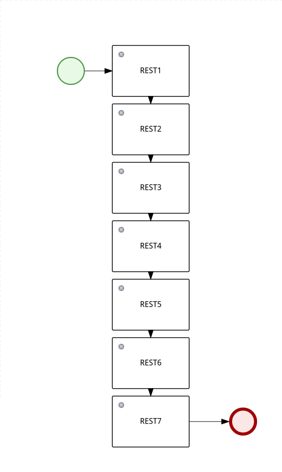
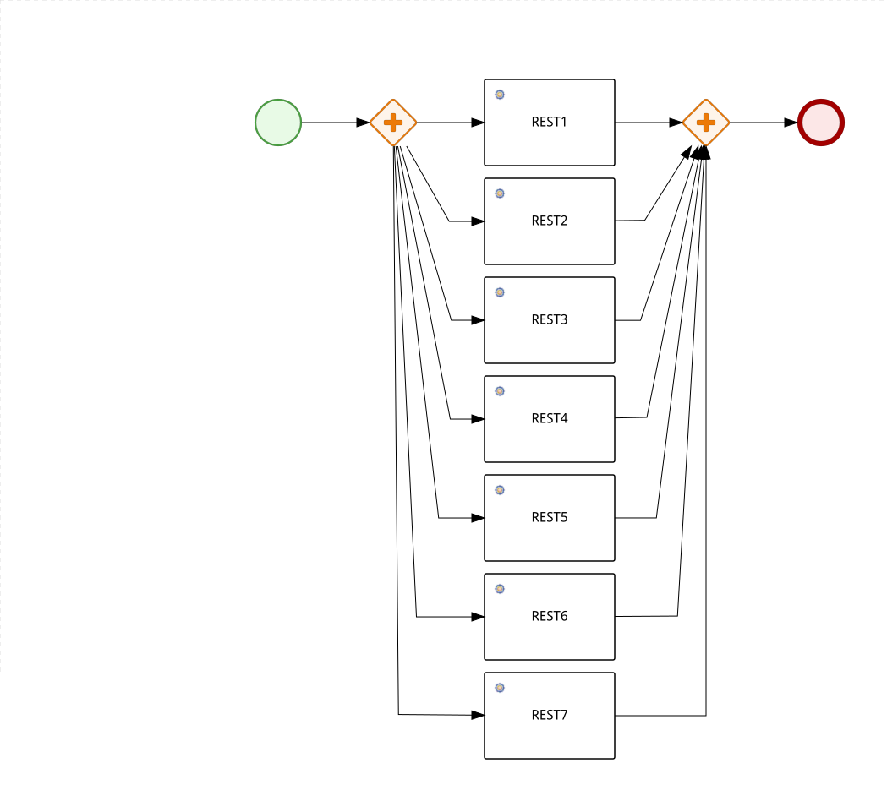

# Comparison of workflow engines

## Motivation

I happen to work with workflow engines a lot on my current position as a software architect. One of my teems is changing it's upstream from an aging [Activiti 6](https://github.com/Activiti/Activiti/tree/activiti-6.0.0) to something cloud native. The current short list is [Kogito](https://github.com/kiegroup/kogito-runtimes) and [Temporal](https://github.com/temporalio/temporal). Load testing is  big part of our selection process, so I decided to make this project. As an additional competitor I decided to add [Zeebe](https://github.com/camunda-cloud/zeebe).

## Products overview

### Activiti

Good old Red Hat jBPM fork. Activiti now has also Activiti 7 (cloud) product, may be later I will add it to comparison too.

### Zeebe

Cloud native platform from Camunda. Zeebe is used to power Camunda Cloud.

### Kogito

New cloud native solution from Red Hat. Still under active development.

### Temporal

A startup based on robust Uber Cadence.

## Test design

I will try to compare candidates on performance, resource utilization and stability.

### Test worflows

#### Start-stop

Just start and stop a workflow, no meaningful workload. The workflow is executed synchronously, generator thread is blocked until workflow is completed.

#### Single REST Task

Just start and stop a workflow, invoke a single REST workload. The workflow is executed synchronously, generator thread is blocked until workflow is completed.

#### Sequential

Execute a workflow that calls REST APIs in a sequence. The workflow is executed synchronously, generator thread is blocked until workflow is completed.

#### Parallel-split

Execute a workflow that calls REST APIs in 5 parallel sequences. The workflow is executed synchronously, generator thread is blocked until workflow is completed.

### Performance

In these test cases we measure absolute engine performance, the idea is to reach target TPS regardless of resource utilization.

#### Performance case 1 (start-stop)

Target is 10 000 workflow starts \ sec for 1 minute.

#### Performance case 1 (single)

Target is 10 000 workflow starts \ sec for 1 minute.

#### Performance case 2 (sequential)

Target is 10 000 workflow starts \ sec for 15 minutes.

#### Performance case 3 (parallel-split)

Target is 10 000 workflow starts \ sec for 15 minutes.

### Resource utilization

These test cases aim to measure engine effectiveness, tests are bound by target resource allocation. Engines do have different architectures, so this test tend to be biased, but still it may provide insight on operations cost.

#### Resource case 1 (start-stop sync)

Target is maximum workflow starts untill error with resource constraint of 10 000 millicores.

#### Resource case 2 (sequential sync)

Target is maximum workflow starts untill error with resource constraint of 50 000 millicores.

#### Resource case 3 (parallel-split sync)

Target is maximum workflow starts until error with resource constraint of 50 000 millicores.

### Stability

These test cases aim to test engine robustness and ability to sustain node failures and component failures.