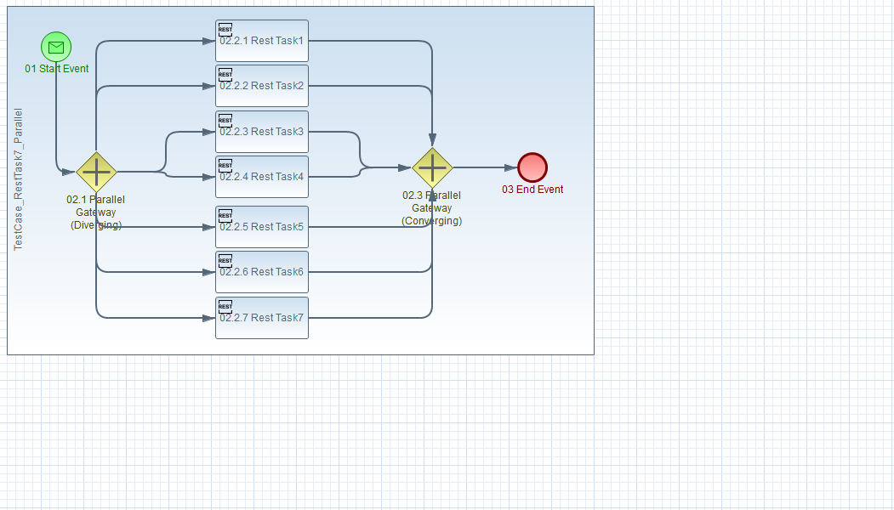

## <a name="deff117e-56cb-4068-b216-74d5b6e933d6"></a> deff117e-56cb-4068-b216-74d5b6e933d6 (TestCase_RestTask7_Parallel)


### 01 Start Event
Принимает Message  
**Event**

| Event Type | Event Details
| :---       | :---            
| Message    | TestCase_RestTask7_Parallel

Формат передаваемого сообщения (Body)
```json
{
    "startMessageName": "TestCase_RestTask7_Parallel",
    "payload": {
      "baseUrl" : "stand.urlModule.Service",
      "serviceUrl" : "stand.urlTestModule.Service",
      "serviceMmtUrl" : "stand.urlTestMmtModule.Service",
      "objectId": "test",
      "variableCount": 5,
      "dataMapCount": 1,
      "subProcess1TimerSec": 5,
      "incomingValue": 100,
      "exitTimerDuration": "PT10S"
    }
}
```

### 02.1 Parallel Gateway (Diverging) 
Gateway Direction = Diverging

### 02.2.1 Rest Task1,  02.2.2 Rest Task2, 02.2.3 Rest Task3, 02.2.4 Rest Task4, 02.2.5 Rest Task5, 02.2.6 Rest Task6, 02.2.7 Rest Task7

| Параметр     | Значение
| :---         | :---   
| URL          | ${serviceUrl}/rest/object/${execution.getProcessInstanceId()}
| Method Name  | GET
| Timeout      | PT10S  
| Retry Policy | 

**HTTP Header List**  

| Name | Value
| :--- |  :---
| Content-Type | application/json; charset=UTF-8;

**Out Parameter List**  

| Variable Name | Expression
| :--- |  :---
| resultRest[1,2,3,4,5,6,7] | @RESULT.myObject2.myObj

### 02.3 Parallel Gateway (Converging)
Gateway Direction = Converging

### 03 End Event