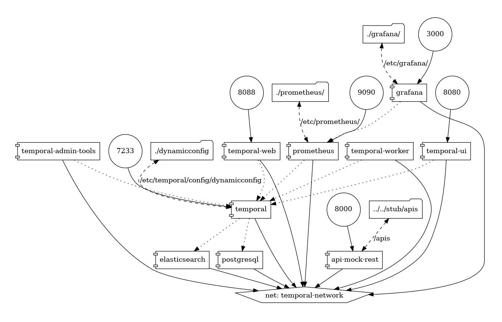

# Temporal load test cases

## Design



```sh
# Prepare environment
alias tctl="docker exec temporal-admin-tools tctl"
```

## Build

Build temporal worker container

```sh
docker build -t temporal-worker:0.1 .
```

## Runtime

```sh
docker-compose up -d

# Create namespace
tctl --ns test-namespace namespace register -rd 1

# view help messages for workflow run
tctl workflow run -h

# Run worker (local run)
go run worker/main.go

# Start workflow with client (local run)
go run start/main.go

# Start single workflow with CLI which call a single REST API
tctl workflow run --tq REST_TASK_QUEUE --wt Single --et 60 -i '"test"'

# Start sequential workflow with CLI
# -i 7 means run 7 REST Tasks in sequence, you may change number
tctl workflow run --tq REST_TASK_QUEUE --wt Sequential --et 60 -i '"test"' -i 7

# Start parallel workflow with CLI, parallel executes exactly 7 REST Tasks
tctl workflow run --tq REST_TASK_QUEUE --wt Parallel --et 60 -i '"test"'

```
