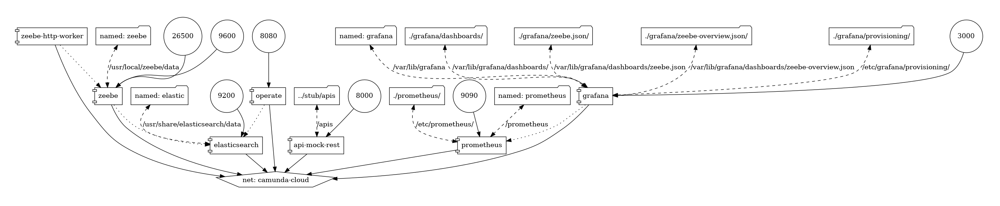

# Zeebe load test cases

## Design

### Architecture



Go get camunda modeler at <https://docs.camunda.io/docs/components/modeler/desktop-modeler/install-the-modeler/>.

Go get zeebe at <https://github.com/camunda-cloud/zeebe/releases> and docker-compose at <https://github.com/camunda-cloud/camunda-cloud-get-started/tree/master>.

Http worker example <https://github.com/camunda-community-hub/zeebe-http-worker>.

We get 4 load test cases:

- start stop
- single rest task
- sequential rest task
- parallel rest task

Due to async zeebe architecture these processes are all async.

## Runtime

```sh
# configur your PATH
export PATH=$PATH:~/Tools/Camunda/zeebe/camunda-cloud-zeebe-1.3.5/bin

# start broker and operate
docker-compose up -d

# in other terminal use zbctl to deal with zeebe
# check status
zbctl --insecure status

# deploy start stop model
zbctl --insecure deploy startStop.bpmn

# start instance
zbctl --insecure create instance startStop --variables '{"username": "test"}'

# deploy and start single task model
zbctl --insecure deploy single.bpmn
zbctl --insecure create instance single --variables '{"username": "test"}'

# deploy and start sequential task model
zbctl --insecure deploy sequential.bpmn
zbctl --insecure create instance sequential --variables '{"username": "test"}'

# deploy and start parallel task model
zbctl --insecure deploy parallel.bpmn
zbctl --insecure create instance parallel --variables '{"username": "test"}'

```

## Operate

Operate is available at <http://localhost:8080>, login with demo|demo.